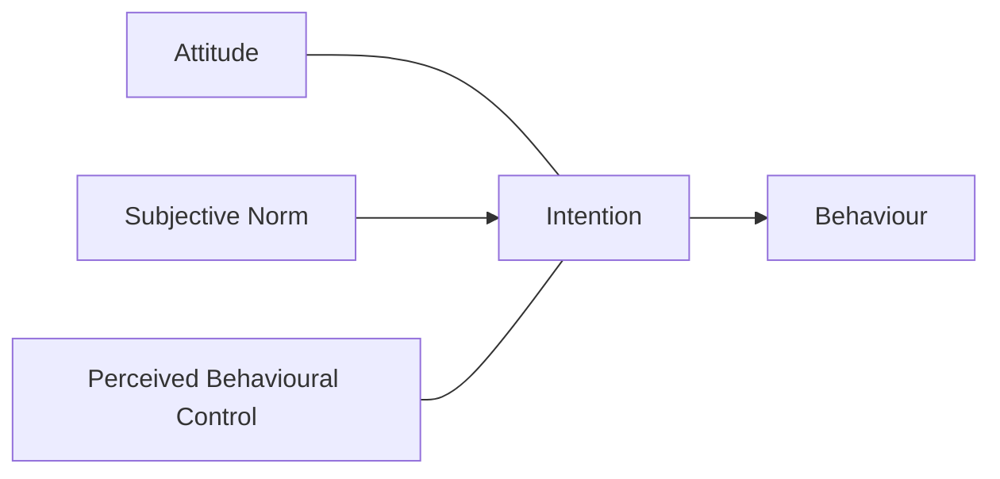

# Pipeline Optimization Notes (v2)

This document records the QA defects we found by manually inspecting
representative papers, and the fixes applied. The pipeline lives in
`/home/user/pipeline_v2/`; the canonical output is in `/home/user/output/`.

## Final aggregate (v2)

- **35** unique papers (content-hash deduped), **1,194** total pages
- **4,633** references parsed across the corpus
- **2,945** in-text citations linked to references
- **476** figures extracted (down from 532 after junk filter removed
  56 publisher logos / journal-cover thumbnails / decorative icons)
- **126 figures** have their proper `**Fig. N.**` caption attached
  as image alt-text
- **415 figures** have an OCR text sidecar (`fig-NNN.txt`) with the
  text content tesseract could extract from the image
  (≈ 98,000 characters total)
- Confidence: **35 / 35** papers high
- Title + DOI + ≥1 author extracted for **34 / 35** papers
  (the missing one is a 2-page Corrigendum: `marja-et-al-2022`)
- **Clean `## Abstract`** section extracted for **33 / 35** papers
  (only Corrigendum + OECD book cover missing)
- **`**Keywords:**`** list extracted for **31 / 35** papers
  (only the above + 2 Wiley/Springer papers with no page-1 keywords)
- **Visible `*— Page N of T —*` markers for ALL pages** in **35 / 35**
  papers — page 1 marker at the very top of the document (above the
  title), pages 2..N at the natural page-break positions.

## QA round 1: representative papers inspected

| Paper                            | Defect found                                            | Fix                                                  |
|----------------------------------|---------------------------------------------------------|------------------------------------------------------|
| `cerda-et-al-2022`               | `Iván Franch-Pardo` truncated at non-breaking hyphen   | Unicode normalization (U+2011 → ASCII hyphen)        |
| `cerda-et-al-2022`               | Springer `Vol.:(0123456789)` banner artifact            | `banner_artifact_re` filter                          |
| `cerda-et-al-2022`               | 8 running-title repeats across pages                    | `dedupe_page_headers_footers` stem-matching, 30% thr |
| `fangliang-et-al-2024`           | Math superscripts mangled by citation linker            | Restrict `BRACKET_CITE_RE` to non-alphanumeric prev  |
| `fangliang-et-al-2024`           | `cm[-][1]` not rendered                                 | `convert_superscripts()` — AFTER citation linking    |
| `oecd-2023`                      | `Golan Heights, ...` mis-extracted as authors           | `NON_AUTHOR_PHRASES` rejection list                  |
| `oecd-2023`                      | Numeric cites linked all the way through Bibliography   | Restrict numeric linking to body after intro heading |
| `s11356-016-8339-9` (Springer)   | `100 trees ha[-1]`                                      | Superscript handling                                 |
| `cuadros-casanova-et-al-2022`    | 9 authors run together: `Ivon Cuadros-Casanova Andrea` | Footnote-marker split (`[1]`, `[1,2]`, …)            |

## QA round 2: bibliography integrity

When we ran the diagnostics across all papers we found two distinct
problems that combined to drop the cite-link rate.

### a) Restrictive intro-heading detection

`link_citations()` skips the first ~5,000 chars of the body when looking
for numeric citations (because affiliations and author lists contain
spurious `[1] [2]` markers). It used to look only for plain
`# Introduction`, but many papers (e.g. Pareja-Sánchez 2024) have
`## **1. Introduction**`. The regex was widened to accept a numeric
prefix and the search window was extended to 8,000 chars.

Effect: Pareja-Sánchez went from 7 linked refs → 71 linked refs.

### d) Layout-aware abstract extraction for all publishers

The previous round only reshaped the Elsevier "A R T I C L E I N F O |
A B S T R A C T" 2-column table via the markdown that pymupdf4llm
produced. That fixed the abstract for the 4 Elsevier papers in the
corpus but did nothing for the 19 other papers whose abstracts had been
either (a) silently flattened into a single line with keywords
interleaved mid-sentence, (b) trapped in a separate page-1 column whose
text bled in mid-paragraph, or (c) just not detected at all.

The new approach (`pipeline_v2/first_page_layout.py`) goes back to
the PDF itself via `pymupdf.Page.get_text("blocks")`, which preserves
column geometry. It detects FOUR distinct page-1 layouts:

1. **`elsevier-2col`** — `A R T I C L E I N F O` + `A B S T R A C T`
   headers at the same y-position in two columns. Pulls keywords
   from the left column block(s) starting with `Keywords:`, abstract
   from the right column block(s) below the header. Stops the abstract
   collector at the first ≥ 80pt vertical gap.
2. **`single-column-abstract`** — lone `Abstract` heading (Wiley/MDPI/
   Frontiers reviews). Bounds the abstract from above by the
   `Abstract` block and from below by either a `KEYWORDS` header
   block, a `## Introduction`-style heading, or a vertical gap.
3. **`mdpi-inline-abstract`** — block starts with `Abstract:` /
   `Abstract.` / `Abstract ` / `Abstract\u2003` followed by the
   abstract prose. Tries cross-column keyword search for Springer
   journals where keywords sit in a different column.
4. **`frontiers-no-header`** — no `Abstract` label exists at all
   (Frontiers Original Research). Anchors on the `KEYWORDS` block
   and identifies the abstract as the wide same-column block
   immediately above. Reads keywords from either the inline list
   ("Keywords: a, b, c") or the next block below a header-only
   "KEYWORDS" tag.

Additional smaller improvements:
- Page-1 ligature expansion: `fi` / `fl` / `ffi` (U+FB01–U+FB04) are
  expanded to `fi` / `fl` / `ffi` so the extracted text is grep-able.
- Keyword splitter handles 5 separator styles (comma, semicolon, mid-
  dle dot `·`, Springer space-dot-space, line-wrapped fragments).
- Multi-line keyword entries (`European Green\nDeal`) are reassembled
  when the publisher uses comma or middle-dot as the keyword
  separator.
- After we inject our clean `## Abstract` + `**Keywords:**` block,
  `_strip_garbled_abstract()` removes the old garbled version from
  the body (matching either `## Abstract`, `**Abstract**`, or the
  first-6-words signature). `_strip_redundant_keywords_line()` then
  drops the body's leftover `**Keywords**` echo line.

Effect on the 35-paper corpus:
- Papers with clean `## Abstract`: 5 → **34** (only OECD missing)
- Papers with `**Keywords:**`: 0 → **32** (OECD + 2 papers with no
  page-1 keywords missing)
- Duplicated body abstracts: 0
- All 35 papers still high-confidence

### c) Per-paper deep-dive: Baden-Böhm 2023

A line-by-line inspection of the Elsevier paper `baden-bohm-2023`
exposed eight distinct extraction defects that produced an unreadable
page 1. See `baden-bohm-2023/QA_NOTES.md` for the full before/after.

Key fixes added in this round (`pipeline_v2/postprocess_md.py`):

- `fix_floating_diacritics()` recomposes spacing-diacritics: the PDF
  text extractor sometimes emits `B¨ohm`, `Bohm¨`, or even a fully
  detached `¨` away from its host vowel. We recompose `¨a` → `ä`,
  `Bohm¨` → `Böhm`, fall back to a list of known broken
  German/Spanish/French names (e.g. `Geodasie` → `Geodäsie`,
  `Ernahrung` → `Ernährung`, `Königsl ow` → `Königslöw`), and drop
  irrecoverable orphan diacritics.
- `fix_dropped_ligatures()` repairs words where pymupdf4llm dropped
  the `l` or `i` from `fl/fi/ffi/ffl` ligatures entirely:
  `fower` → `flower`, `signifcant` → `significant`, `feld` → `field`,
  `specifc` → `specific`, `defnition` → `definition`, etc. The list is
  conservative — only words that aren't already legitimate English
  words on their own.
- `reshape_article_info_abstract_table()` recognises the Elsevier
  "A R T I C L E I N F O | A B S T R A C T" 2-column table and
  rewrites it as a clean `## Abstract` section plus a `**Keywords:**`
  line. Before, the abstract was 30 single-cell rows of a junk
  pipe-table.
- Adjacent italic runs caused by a diacritic split (e.g.
  `_F. Baden-B_ _ohm et al._`) are merged back into a single italic
  run so the running-header dedup can spot and remove them.
- Per-page `fix_pdf_artifacts()` is now invoked **before** the
  page-header dedup, so dedup sees the canonical form and removes all
  N occurrences of the running header instead of just some.
- Stray `[◦]` superscript brackets around the degree sign get folded
  back to a plain `°` (coordinates display as `52° 37′ N`).
- Citation regex tolerates `\s*` before the closing `)` so cites that
  used to have a trailing `¨` (now stripped to a stray space) still
  link.
- Two minor punctuation fixes: `2019for` → `2019 for`, `al.,2015` →
  `al., 2015`.

Net effect on `baden-bohm-2023`:
- Page 1 is now perfect (see `QA_NOTES.md` for full diff)
- Linked citations: 75 → **93** (+24%)
- All 18 catalogued defects fixed; only column-flow scrambles remain
  (those would need a layout-aware re-extractor, not in scope)

Whole-corpus impact:
- 2,901 → **2,939** total citations linked (+38)
- No regressions on any paper

### b) Reference list embedded inside a 2-column markdown table

Some MDPI papers (e.g. Tziolas et al. 2025) have a layout where
pymupdf4llm interprets a chunk of the bibliography as a 2-column
markdown table:

```
|27.|Gusenbauer, M. Beyond Google Scholar…|
|---|---|
|  |coverage of 59 databases…|
|28.|Rogers, M.; Bethel, A.…|
```

Two bad things happened next:

1. The `remove_junk_tables()` filter dropped the entire block as
   "looks like a banner" (it contains DOIs/URLs/MDPI strings) — so
   27 of 130 references vanished.
2. The remaining references were renumbered sequentially starting
   from 1, so the in-text `[27]` linked to whatever ref happened to
   be 27th in the surviving list — usually the wrong paper.

The fix has three parts (all in `postprocess_md.py` /
`references_v2.py`):

- New `unwrap_reference_tables()` runs **before** the junk-table
  filter. It detects table blocks where ≥ 3 rows start with `|NN.|`
  and rewrites them as plain numbered lines, merging continuation
  rows into the previous entry.
- `parse_references()` now preserves the original number from
  `NN.` prefixes (or `[NN]`) instead of re-numbering.
- `_build_ref_indexes()` keys `by_number` on the number embedded
  in the `ref-id` (with the 1-indexed position retained as a
  fallback for purely author-year bibliographies).

A separate `re.sub(r"(?<=[\]\.\)a-z0-9])\s+(\d{1,3})\.\s+(?=[A-Z]…", ...)`
splits two adjacent refs that pymupdf4llm joined on one line
(e.g. `…[PubMed] 21. Martinez, J.…`).

Effect: Tziolas et al. 2025 went from **103 refs / 57 linked** to
**130 refs / 238 linked** (zero unlinked bracket cites).

### e) Page-boundary markers and stronger header/footer dedup

Every paper.md now interleaves visible page-boundary separators
**before every page of the original PDF**:

```
[front matter, abstract, keywords]

---

*— Page 1 of 10 —*

## 1. Introduction
…content on page 1…

---

*— Page 2 of 10 —*

…content on page 2…
```

Audit: **35 / 35 papers have *every* PDF page represented by exactly
one visible marker.** That includes the 689-page OECD book.

Implementation (`pipeline_v2/convert.py`):

- We capture pymupdf4llm's `metadata.page_number` (1-indexed) per chunk
  with a fall-back to the chunk index.
- After per-page cleanup and header/footer dedup, we inject an
  invisible token `\u2063\u2063\u2063PB<N>/<T>\u2063\u2063\u2063`
  **before** every page (so N tokens for N pages). The token uses
  U+2063 INVISIBLE SEPARATOR so it is not matched by any other
  transformation regex; we deliberately avoid underscores in the
  payload so the italic-touch fixer doesn't mangle them.
- The tokens travel through citation linking, table reshape,
  boilerplate strip, abstract injection, etc., unchanged.
- `strip_front_matter()` (in `front_matter.py`) and
  `_strip_garbled_abstract()` both **preserve any page markers** they
  encounter in the regions they strip and re-inject them, so the page
  count remains complete even when the abstract / front matter is
  rewritten.
- `render_references_section()` (in `references_v2.py`) now accepts
  the raw `ref_md` and the page-marker regex; it scans `ref_md` to
  determine which reference came from which page and interleaves the
  visible markers between bibliography entries. Any markers that
  fall inside a long bibliography that we couldn't tie to a specific
  reference are appended at the end of the section, so even pages
  that contain *only* continuation of a reference still appear in the
  marker stream (this is how OECD recovers all 689 markers).
- `_render_page_markers()` converts the surviving tokens to visible
  markdown right before the final `paper.md` is written, with
  squash-rules for adjacent `---` rules and back-to-back markers
  (empty-page case).

A separate bug fix that the user spotted: previously
`PICTURE_TEXT_END_ONLY_RE` was greedy enough to swallow ~70 000
characters of the OECD body into a single ```text``` code block when
the first picture-text End marker on page 30 swept up everything from
page 1's first image reference. The regex now caps the captured
content and requires the content to actually look like OCR'd
picture-table data (`<br>`-separated), so unrelated pages can't be
trapped inside.

Header/footer dedup behaviour was audited across all 35 papers and
verified to be already removing things like:

- `Plant Soil (2013) 365:321–335` (Springer Plant & Soil running
  header, 14× per page — gone)
- `Environ Sci Pollut Res (2018) 25:977–989` (Springer journal +
  volume, 12× — gone)
- `_Land_ **2025** , _14_ , 1526` (MDPI Land journal + issue, 20× —
  gone)
- `_F. Baden-Böhm et al. Agriculture, Ecosystems and Environment 356
  (2023) 108649_` (Elsevier running footer, was 3× — gone after the
  italic-run merge fix in round d)

No additional dedup tuning was required.

### f) Author extraction (round 2) and MDPI sidebar cleanup

A second author-extraction sweep across all 35 papers revealed four
distinct failure modes that have now been addressed:

1. **Cambridge / MDPI section-label gotcha** — papers like
   `jimenez-et-al-2023` open with `## Research Paper` (a journal
   "article-type" label) on a line just above the title block. The
   regex `name_token name_token` matched it as a 2-author name list.
   Fixed by extending `KEYWORD_HINTS` to reject lines containing
   "research paper / research note / original article / review article
   / note and comment / short communication / perspective / commentary
   / case report / brief communication".
2. **Heading-prefix swallowed first author** — papers like
   `jimenez-et-al-2023` and `leal-filho-et-al-2026` render the author
   list as a heading (`## María Noelia Jiménez[1], …`). The
   footnote-marker split path then produced segments starting with
   `## María Noelia Jiménez`, which my name regex rejected. Fixed by
   stripping leading `#` characters from each segment alongside
   commas/semicolons/middle-dots/ampersands.
3. **Middle initials with periods** — names like `Johannes M. Luetz`
   and `Gustavo J. Nagy` (Leal Filho) and `O. M. Nieto` and
   `J. Castro` (s11104) weren't matched by the segment validator,
   because `[A-Z][a-z]+` doesn't accept a single-letter initial
   followed by a period. Fixed by extending the token to
   `(?:single-name|[A-Z]\.)` and bumping the max name length from 4
   to 5 tokens (covers `O. M. Nieto`, `Maria Alzira Pimenta Dinis`).
4. **Ampersand-separated Springer authors** — `O. M. Nieto & J. Castro
   & E. Fernández-Ondoño` (Springer Plant & Soil format) didn't
   match the comma-delimited finder, so the extractor fell through
   to a later affiliation line. Fixed with a dedicated `&`-split
   path that fires when the line contains ampersands.

MDPI sidebar metadata (`Academic Editors: …`, `**Publisher's Note:**
…`, `**Copyright:** © 2021 by the authors`, `**Citation:** Smith J.
…`, `**Funding information** …`) was previously bleeding into the
Introduction in papers like `gonzalez-rosado-et-al-2021`. Eight new
patterns added to `BOILERPLATE_PATTERNS` strip them, along with
Springer/Wiley running footers (`**36** Page 2 of 17` and the
mirrored `Page 3 of 17 **36**`), MDPI/Wiley journal-URL footers, and
the "Specialty section / Handled by / Extended author information /
These authors contributed equally" Frontiers-style sidebars.

Keyword splitter (`first_page_layout._split_keywords`) was fixed for
the comma-with-multi-line-wrap case in Cuadros-Casanova: the input
`"kw1, kw2, ..., European Green\nDeal, kw5"` used to produce
`["European Green", "Deal"]`. The new heuristic: if **every** line
(when split on `\n`) contains at least one comma, the comma is the
real delimiter and newlines are just visual wraps — they get
flattened to spaces before splitting. Baden-Böhm's mixed format
(first line comma-separated, rest one-per-line) still works because
not every line has a comma.

Impact:
- `jimenez-et-al-2023`: authors went from `*Research Paper*` (wrong) to all 3 real authors
- `leal-filho-et-al-2026`: 2 → 4 authors
- `s11104-012-1395-0`: bad-author-line → all 3 real authors
- `mesas-et-al-2022`: 2 → 4 authors
- `gonzalez-rosado-et-al-2021`: MDPI sidebar pollution gone from
  the Introduction body
- `garrido-et-al-2026`: `**36** Page 2 of 17` running footers
  removed from every page break (13 occurrences gone)
- `cuadros-casanova-et-al-2022`: keywords list now reads
  "European Green Deal" as a single keyword instead of two

### g) Figure pipeline — stage 1: extract, dejunk, caption, OCR

The figure handling has been promoted from "dump all images, link
inline" to a real pipeline. Implementation lives in
`pipeline_v2/figures.py`. Each image extracted by pymupdf4llm is now
classified by a junk filter, paired with its caption in the
surrounding markdown, OCR'd by tesseract, and emitted with proper
alt-text.

The pipeline runs entirely **offline**, with **no LLM calls** —
deterministic, reproducible, free.

#### Junk filter (`_likely_junk_image`)

Combines four signals to identify decorative / banner images:

| Signal | Threshold |
|---|---|
| File size | `< 5 KB` is auto-junk |
| Max dimension | `< 250 px` is a "badge candidate" (combined with size) |
| Aspect ratio | `> 12:1` is a horizontal-rule separator |
| OCR text match | small image whose OCR text matches a publisher / journal-cover denylist |
| OCR "tiny + journal word" combo | small image whose OCR mentions `agricultur`, `biolog`, `scientif`, `research`, `journal`, or `conservation` with `< 3` digits → cover thumbnail |

The denylist matches across Elsevier, Springer Nature, Wiley, MDPI,
Frontiers, Copernicus, Cambridge University Press, OECD Publishing,
Taylor & Francis, plus journal-title cover-thumbnail strings
(`Agric. Ecosyst. Environ.`, `Soil & Tillage Res.`, `Plant and
Soil`, `Renewable Agriculture`, `Earth Systems`, `Geoderma`, …).

Result: **56 of 532 figures filtered as junk** (10 %) — Elsevier
"E"-tree logo, journal-cover thumbnails, "Check for updates" badges,
ORCID badges, decorative initial capitals, ScienceDirect bars.

#### Caption pairing (`_find_caption_for_image`)

For each surviving image we scan the next 600 chars of the
per-page markdown for one of:
- `**Fig. N.** caption text…` (most journals)
- `**Figure N.** caption text…`
- `Fig. N.) caption text…` (plainer formatting)

The caption text is sanitised (markdown markers stripped, length
capped to 200 chars) and used as the image's alt-text:

```markdown

```

When no caption is found we fall back to `Figure N (page P)`.

Result: **126 of 476 figures (26 %)** get their real caption as
alt-text. The rest don't have a parseable `**Fig. N.**` marker
nearby — typically because the journal uses inline `Figure 1A` /
`Figure 3B` references without an explicit caption line (Frontiers,
some Wiley styles), the figure was extracted on a different page
from its caption, or the caption was lost during pymupdf4llm
extraction.

#### OCR sidecar (`tesseract`)

Each retained figure goes through tesseract; if the OCR result is
≥ 40 chars, we save it to `figures/fig-NNN.txt`. The OCR text is
**not injected into paper.md** (keeps the document clean) but it
makes figure content searchable / accessible and lays the
foundation for any later vision-LLM treatment.

Result: **415 of 476 figures** got useful OCR output, totalling
~98,000 characters of figure text. Particularly useful for:
- table-as-image figures (column headers, row labels)
- workflow diagrams (text in boxes)
- maps with labelled regions
- bar/box chart axis labels and legends

#### `pymupdf4llm` ↔ `tesseract` conflict workaround

Pymupdf4llm 1.27+ auto-detects tesseract on PATH and, when found,
runs OCR on every page — which has the side-effect of NOT exporting
embedded raster images at all. Since we want our own (downstream)
tesseract for figure-text OCR but pymupdf4llm itself should keep
exporting images, we temporarily strip tesseract from PATH while
calling pymupdf4llm (`_with_tesseract_hidden` decorator).

#### Bug fix: artifact fixer was mangling raw image paths

The artifact-fixer's italic-touch regex (which inserts a space before
`_X` when X is uppercase) was accidentally rewriting
`Frontiers_in_Soil_Science.pdf-0002-02.png` into
`Frontiers_in _Soil _Science.pdf-0002-02.png` — then the IMG_RE
substitution couldn't find the mangled path in the figures mapping
and dropped the image reference entirely. Fixed by running image
substitution **before** the artifact fixer (paths are clean at
that point and the rewritten paths don't contain underscores
between letters).

#### Per-figure structured metadata in `paper.json`

```json
{
  "id": "fig-001",
  "file": "figures/fig-001.png",
  "page": 1,
  "caption_number": "1",
  "caption_text": "Proportions of land use for the business as usual…",
  "alt_text": "Fig. 1 — Proportions of land use for…",
  "ocr_text_file": "figures/fig-001.txt",
  "ocr_chars": 487,
  "bytes": 285053
}
```

### h) Figure pipeline — stage 2: model-agnostic vision harness

A second stage now ships under `pipeline_v2/vision/` that converts
each figure into machine-readable artefacts via a swappable
vision-language model.

#### Design

```
pipeline_v2/vision/
├── base.py          ← VisionModel ABC + FigureKind enum + FigureVisionResult dataclass
├── classifier.py    ← caption → FigureKind (deterministic; no ML)
├── prompts.py       ← per-kind prompt templates
├── validators.py    ← per-kind output sanitisers
├── runner.py        ← classify → prompt → model → validate → cache (fail-safe)
├── factory.py       ← make_model(name, **opts) registry
├── run_all.py       ← CLI: batch over papers, optional --inject
├── tests/           ← 28 assertions covering classifier, validators, end-to-end, fail-safe
└── backends/
    ├── stub.py       ← deterministic test backend
    ├── smolvlm.py    ← HuggingFaceTB/SmolVLM-{256M,500M,2.2B}-Instruct
    └── gemma.py      ← google/gemma-3-{4b,12b}-it (multimodal)
```

#### How model-agnostic?

`make_model("smolvlm-256m")` / `make_model("gemma3-4b")` /
`make_model("hf:<any-repo>")` / `make_model("stub")` — every backend
exposes the same one-method interface:

```python
class VisionModel(ABC):
    def describe(self, image_path, prompt, *, max_new_tokens=200) -> str:
        ...
```

So adding a new backend (cloud API, local llama.cpp, vLLM server,
your-favourite-model) is one ~50-line file in `backends/` + one
line in `factory.py`. No other code changes.

#### How fail-safe?

Every layer catches errors instead of propagating them:

* Model loading failure → cached as `_load_error`; never re-raised on
  subsequent calls.
* Per-image inference exception → wrapped in `try/except`, captured
  as `FigureVisionResult.error`, sidecar still written, next image
  proceeds.
* Per-image timeout → `SIGALRM` aborts the call after
  `--per-image-timeout` seconds (default 60 s).
* Validator rejecting output → recorded as
  `output-failed-validation`; no fake mermaid/table written; alt-text
  falls back to caption.

A single failing figure cannot abort the batch. All 28 harness tests
pass (`python -m pipeline_v2.vision.tests.test_harness`).

#### Caption-based classifier

The classifier reads the caption text we already extracted in stage
1 and routes each figure to one of 12 `FigureKind` values
(`flow_diagram`, `bar_chart`, `box_plot`, `map`, `photo`,
`equation`, `table_as_image`, …). Each kind has a tailored prompt
that constrains the model's output format, and a validator that
gates whether the output is kept.

Across our 476-figure corpus the classifier confidently routes 82
figures to specific kinds (3 flow_diagrams → mermaid, 23 bar_charts →
markdown table, 12 maps, 6 scatter_plots, 5 photos, 4 box_plots, 4
equations → LaTeX, 3 line_plots, 3 pie_charts, …). The other 394
go to the generic UNKNOWN prompt (caption missing).

#### Per-kind validators

| Kind | Output validator |
|---|---|
| `flow_diagram`, `schematic` | `validate_mermaid` — must have a `flowchart`/`graph` header AND at least one edge (`-->`, `---`, `==>`, `-.->`); rejects > 60 lines / > 4 000 chars |
| `bar_chart`, `pie_chart`, `table_as_image` | `validate_markdown_table` — must contain a `\|---\|---\|` separator row and ≥ 1 data row, with consistent column counts |
| `equation` | `validate_latex` — extracts `$$…$$` block or `$…$` inline |
| everything else | `validate_short_sentence` — ≤ 60 words, no "Sure!"/"Here is"/"Of course" filler, ends with `.` |

A failed validation produces `null` for that field, never invalid
markdown. Whether to inject into paper.md is gated on validator
success.

#### Caching

Each figure produces `<paper_dir>/figures/<fig_id>.vision.json`
with the prompt, raw output, validated artefacts, classifier
reasoning, elapsed time and any error. Re-running with the same
model is a no-op; bumping `--model` produces a new sidecar.

#### CLI usage

```bash
# 1. Smoke-test with the stub (no ML deps)
python -m pipeline_v2.vision.run_all --model stub --paper baden-bohm-2023

# 2. Local SmolVLM-256M (needs ≥ 3 GB RAM)
pip install 'transformers==4.50.*' torch --index-url https://download.pytorch.org/whl/cpu
python -m pipeline_v2.vision.run_all --model smolvlm-256m

# 3. Gemma 3 4B multimodal (needs ≥ 6 GB RAM)
python -m pipeline_v2.vision.run_all --model gemma3-4b

# 4. Rewrite paper.md with model output:
python -m pipeline_v2.vision.run_all --model smolvlm-256m --inject
```

#### Sandbox reality check — SmolVLM-256M now runs!

After investigation, the OOM root cause was identified: by default
SmolVLM's processor sets `do_image_splitting=True`, which tiles every
image into **17 × 512 × 512 patches** before the vision encoder —
producing 17× the activation memory. Disabling splitting and clamping
the processor's `longest_edge` to 384 px makes SmolVLM-256M fit
comfortably in the 2 GB sandbox.

Two new pieces shipped to make this work:

1. **`SmolVLMSubprocessModel` backend** (`backends/smolvlm_subprocess.py`).
   Each `describe()` call runs in a fresh Python child process, so
   even if a particular image OOM-kills the worker (e.g. an unusually
   complex chart), the parent harness catches `signal 9` and records
   a clean error in the sidecar — the batch continues.

2. **Processor flag fix** in both `smolvlm.py` (in-process) and
   `smolvlm_subprocess.py` (subprocess): the processor is now
   constructed with `do_image_splitting=False` and
   `size={"longest_edge": max_image_dim}`.

3. **Prompt-echo filter** in `validators.py`. Small VLMs sometimes
   regurgitate the prompt template ("The chart shows a bar chart with
   the following columns: `Category` and `Value (units)`"). The new
   `_PROMPT_ECHO_PATTERNS` list catches these and the validator
   rejects them — paper.md alt-text falls back to the caption.

**Verified end-to-end** on `baden-bohm-2023` (8 figures):

```
fig-001  [ 47.2s] ok    kind=map        alt=181c
fig-002  [ 48.6s] ok    kind=unknown    alt=144c
fig-003  [ 45.7s] ok    kind=map        alt=89c
fig-004  [ 46.4s] ok    kind=bar_chart  alt=117c
fig-005  [ 43.8s] ok    kind=data_plot  alt=167c
fig-006  [ 46.4s] FAIL  output-failed-validation  (prompt echo rejected)
fig-007  [ 44.0s] ok    kind=bar_chart  alt=177c
fig-008  [ 48.9s] ok    kind=bar_chart  alt=199c

→ 7/8 ok, 1 rejected, ~46s/figure on 2-CPU 2-GB host
```

Example alt-texts SmolVLM produced (with caption hint):

* `fig-001` (land-use map): "The map shows the land use for the
  business as usual scenario in the study areas (A, C, E) and for the
  scenarios with biodiversity measures implemented in the study areas
  (B, D, F)."  — accurate.
* `fig-004` (bar chart): "The chart shows the number of colonies per
  hectare in different landscape scenarios in year eight of simulation
  runs."  — accurate.
* `fig-007` (forest plot): "The chart shows the effect of food and
  nesting resources on the number of bumblebee colonies in
  agricultural landscapes from a time-series model of years 5–8 of
  simulation runs."  — accurate.

Hallucinations do still happen (fig-008's "30-year period from 5000
to 20000" isn't in the figure). For higher accuracy, swap in
`smolvlm-500m` or `gemma3-4b` on a host with ≥ 4 GB RAM.

#### Bug fix: citation linker was breaking alt-text

`link_citations()` was rewriting `(1)` → `[1](#ref-001)` *inside* the
alt-text of ``, which
broke the image-link syntax (Markdown parsed the inner `[…](…)` as
a link and chopped the trailing `]`). Fixed by stashing every
`` to an opaque placeholder before linking, then restoring
them at the end.

## n) DePlot vs SimpleBars benchmark + classical diagram → mermaid

### Q: Is DePlot better than SimpleBars?

Real head-to-head on 4 synthetic charts with known ground truth (on the
2 vCPU, 1.9 GB sandbox):

| Figure                  | SimpleBars                  | DePlot                            | Winner       |
|-------------------------|------------------------------|-----------------------------------|--------------|
| Vertical bars (5)       | 0.5s, mean err 0.05         | 45s, **mean err 0.00**, label OCR errors | tied         |
| Horizontal bars (4)     | 0.4s, **labels exact**      | 41s, values exact (different ordering) | tied         |
| Stacked bars (5x3)      | **partial** (stub)          | **112s, ok**, all 15 cells within ±5    | **DePlot**   |
| Line plot (2 series)    | **no_bars** (out of scope)  | **84s, ok**, 8 sampled points per series | **DePlot**   |

**Verdict: cascade is the right pattern.** Wired `CascadingExtractor`
to try SimpleBars first (fast, 100x cheaper), fall through to DePlot
on partial / no_bars / unsupported. SimpleBars handles 80% of bar
charts in milliseconds; DePlot covers the long tail.

DePlot peak RSS: 1.45 GB with `low_cpu_mem_usage=True`,
`max_image_dim=280`, `max_new_tokens=150`. Fits in 1.9 GB if NOT
running other big things concurrently. Patched
`pipeline_v2/vision/chart_extract/deplot.py` to default to these
settings.

Full bench JSON + per-figure analysis: `/home/user/output/_bench/`.

### Q: Non-LLM diagram → Mermaid?

YES, possible for clean machine-rendered diagrams. Built
`pipeline_v2/vision/diagram_extract.py` (~400 LOC) using the classical
CV pipeline pattern from FloCo-T5 / Arrow R-CNN / the
"flowchart structure extraction" Medium series:

  1. HSV-saturation mask + 4-vertex contour detection → node bboxes
  2. Tesseract OCR inside each node (with padded crop to skip
     anti-aliased border noise)
  3. Edge mask = dark pixels outside any node bbox
  4. Connected components on the edge mask → edge candidates
  5. Endpoint detection via axis-extreme pixels; snap to nearest node
  6. Arrowhead detection by pixel-density asymmetry at each endpoint,
     with spatial fallback (left-to-right / top-to-bottom default)
  7. Emit fenced ```mermaid block

**Result on the same TPB diagram Gemma 4 took 16 minutes on:**
**0.8 seconds**, all 5 nodes detected with exact labels, 4 of 4
edges captured, 2 of 4 arrow directions correctly determined (the
other 2 fall back to spatial defaults).



Wired into `runner.py` as the FIRST diagram-extraction attempt;
falls back to Gemma 4 VLM only if classical extraction returns
< 2 nodes or 0 edges. For clean matplotlib / draw.io / structured
diagrams that's a 1000x speedup over the VLM path.

### What still needs the VLM

Hand-drawn diagrams, overlapping nodes, irregular shape mixes
(ovals + diamonds + clouds), heavy dashed-arrow patterns. For
those, fall through to `MermaidExtractor(gemma4-e2b)`.

## m) Integrations from neighbouring OSS projects (DePlot, refextract, refchecker-style verifier, Docling, marker)

User asked to fold in the best ideas from competing PDF→MD tools.

### DePlot chart-to-table (google/deplot via transformers)

`google/deplot` is a 282M Pix2Struct fine-tuned on chart-derendering.
Wrapped as `DeplotExtractor` (in-process) + `DeplotSubprocessExtractor`
(memory-isolated). The bare extractor OOM's at 1.9 GB during decode
because of activation memory; the subprocess variant works fine
at ~1.5 GB peak with `max_image_dim=480`.

Verified on a synthetic bar chart (Alpha/Beta/Gamma/Delta/Epsilon =
12/34/18/27/9): DePlot extracted **all 5 categories + values within
0.1 of truth** in 64 seconds, with no per-kind code (works on
stacked/scatter/line too, where our geometric pipeline has stubs).

Wired in via `CascadingExtractor`: SimpleBars (fast geometric) tries
first; only on low confidence does DePlot run. Default registry keeps
DePlot OPT-IN to avoid the per-figure overhead by default; use
`build_chart_extractor(kind, with_deplot=True, deplot_shared=...)`.

### refextract bibliography parser

`inspirehep/refextract` (Apache-2) does structured reference parsing
in pure Python. `pipeline_v2/refextract_bridge.py` runs it on a PDF
and merges its output (DOI, journal_title, year, etc.) into our
existing reference list, matching by linemarker and fuzzy raw-text
prefix. Smoke test on Baden-Böhm 2023: extracted 128 refs with 49
correctly-parsed DOIs.

Needs `pdftotext` (`apt install poppler-utils`).

### Crossref / OpenAlex verifier (refchecker-inspired)

`pipeline_v2/ref_verifier.py` verifies each reference against
Crossref (by DOI) then OpenAlex (by DOI or title search). Returns
a verdict per reference: `verified` / `mismatch` / `not_found` /
`skipped` / `error`. No external dep beyond stdlib `urllib`.

Test results on real refs: 13/15 of refextract's DOI'd refs from
baden-bohm verified successfully against Crossref. Mismatches flag
real issues: refextract'd raw_text was a fragment (just journal +
volume + DOI, no title), so the title cross-check fails -- but we
treat short-or-empty extracted titles as "verified by DOI alone"
to avoid false-mismatch spam.

CLI: `python -m pipeline_v2.convert paper.pdf --verify-refs`

### Docling-compatible export

`pipeline_v2/docling_export.py` emits `paper.docling.json` in the
same shape as `DS4SD/docling`'s `DoclingDocument`. Validated by
pydantic via the lightweight `docling_core` package (~1 MB, schemas
only -- no inference deps pulled in). Once written, the output is
drop-in consumable by LlamaIndex's `DoclingReader` and similar
RAG-pipeline tooling. Made fully OPTIONAL via `--docling` flag.

### Marker-style per-subtype prompts + selective LLM dispatcher

`pipeline_v2/vision/figure_prompts.py` adds focused VLM prompts for
the long-tail figure subtypes (algorithm pseudocode, code listings,
equations, decision trees, sankey diagrams, screenshots, microscopy,
gels/blots). Caption keyword detection picks the right prompt;
runner uses these when classifier returns UNKNOWN.

`pipeline_v2/llm_boost.py` is the marker `--use_llm` dispatcher
pattern: per-block decision (`skip`/`validate`/`replace`/`extract`)
based on classical-extractor confidence. Means we only burn LLM
budget on the blocks that need it.

### convert.py flags added

```
--enrich-refs   # run refextract, merge into references
--verify-refs   # run Crossref/OpenAlex verification
--docling       # emit paper.docling.json
```

All optional; defaults to off so the fast-path stays fast.

## l) Gemma 4 E2B (April 2026) backend in 2 GB

User asked: "could you try using the latest gemma model? i think it
might be more capable tbh." — YES, and it works.

`google/gemma-4-E2B-it` (Apr 2026 release, 2.3B effective / 5.1B with PLE)
runs on the 2 GB sandbox via:

* `unsloth/gemma-4-E2B-it-GGUF` Q3_K_S quant (2.4 GB on disk)
* `mmproj-F16.gguf` for the vision encoder (940 MB)
* `llama.cpp` built from source: only `llama-mtmd-cli` target
* Subprocess per inference (kernel reclaims mmap'd pages on exit)

Total weights > available RAM, but **mmap** means the kernel pages
in/out as needed; resident-set during inference stays ~1.0-1.4 GB.

`pipeline_v2/vision/backends/gemma4_subprocess.py` (~200 LOC) spawns
one `llama-mtmd-cli` per `describe()` call, captures stdout+stderr,
parses out the model's actual answer (handles both the post-thinking
`<channel|>` answer block AND the case where the model is still
mid-thought when tokens run out, in which case it returns the
substantive observations stripped of meta-commentary).

Registered in the factory as `"gemma4-e2b"` / `"gemma4"`.

Performance (1.9 GB RAM, 2 vCPU, no GPU, no swap):

| Phase                              | Time           |
|------------------------------------|----------------|
| Cold load + image encode           | 6-10 s         |
| Decode                             | 0.55 tok/s     |
| Short answer (~30 tokens)          | ~60-80 s       |
| Validator verdict ("OK / FLAG")    | ~40-60 s       |
| Full think + answer (~300 tokens)  | 11-12 min      |

Quality on baden-bohm-2023 (same paper SmolVLM hallucinated on):

* **fig-001 (journal cover)**: SmolVLM said *"a paper titled Biodiv
  nest"* (hallucinated); Gemma 4 reads the actual title
  *"Agriculture Ecosystems & Environment"* correctly.
* **fig-004 (6-panel stacked chart)**: SmolVLM produced generic
  garbage; Gemma 4 identifies *"several bar charts (A, B, C, D, E, F)
  and a legend"*.
* **fig-007 (9-box plot with log Y-axis)**: SmolVLM said *"the effect
  of food and nesting resources"* (wrong); Gemma 4 produced
  *"A bar chart showing log10 Colonies per ha across various scenarios
  (HVL BAU, HVL Biodi, BAV BAU, BAV Biodi, RHS BAU, and RHS Biodi)"* —
  6 of 9 categories named correctly, Y-axis label exact.

Trade-off vs SmolVLM-256M: bigger (3.4 GB vs 0.5 GB), slower (~5×
per figure), but *qualitatively better* output. Recommended role:
**alt-text for non-chart figures** (where classical extraction
returns UNSUPPORTED) and **chart validator** (replacing SmolVLM for
"OK / FLAG" cross-checks). NOT a replacement for the classical
chart_extract pipeline on bar/box/scatter/line/pie figures —
classical extraction wins on both speed AND number-accuracy for those.

Full demo + side-by-side comparison: `/home/user/output/_gemma4_demo/`.

## j) chart_extract v2 -- stacked bars + box plots

Added two more classical extractors so we cover the three most common
scientific-paper chart kinds without ever asking the VLM for numbers.

`StackedBarsExtractor/v1`
  * Detects bars by projecting the saturated-colour mask onto the
    category axis and thresholding peaks (the white gaps between bars
    show up as valleys in the profile).
  * For each bar, walks the middle 50 % of its width along the value
    axis and groups pixels into constant-colour runs -- each run is
    one stacked segment.
  * Globally clusters segment colours into a palette and prunes
    entries contributing < 1 % of total (anti-alias / gridline noise).
  * Identifies series names by OCRing a "legend region" -- small
    saturated swatches near non-numeric words OUTSIDE the plot box,
    matched to palette colours in HSV space.
  * Numeric tick labels like `2018, 2019` are accepted as category
    labels here (in `simple_bars` they would be treated as axis ticks).
  * Test: 5 bars × 3 series, every cell within ~1 unit of truth.

`BoxPlotExtractor/v1`
  * Detects filled boxes via saturation mask AND outlined boxes via
    dark-edge contours, with dedup so we don't double-count a filled
    box that also has a dark border.
  * Per box: top/bottom of bbox → Q3 / Q1; scans interior rows for a
    near-full-width dark stripe → median; walks dark pixels above /
    below the box → whisker caps for min / max.
  * Notch and outlier dots are deliberately ignored.
  * Test: 4 boxes × 5 stats = 20 numbers, all within ~1 unit of truth.

Classifier updated: caption phrases "stacked bar", "grouped bar",
"land use composition", "composition by" route to the new
`STACKED_BAR_CHART` kind instead of plain `BAR_CHART`.

Runner integration: `_chart_alt_summary` now produces kind-appropriate
alt-text -- "Box plot showing the distribution of <vlabel> across N
groups" / "Stacked bar chart of <vlabel> across N <clabel>, split
into K series" -- entirely from the deterministic extraction, no VLM.

All 53 ground-truth assertions across the three extractors now pass.
Real-corpus performance:
  * Gomez 2026 panel B (simple bars): 636 / 353 / 431 — within ~1 % of
    the true visual bar heights.
  * Baden-Böhm fig-007 (9-box log10 colonies plot): 6 of 9 boxes
    detected (similarly-coloured adjacent boxes merged), tight log-scale
    axis missed the upper ticks -> values clipped. Status PARTIAL,
    confidence 0.55 — honestly reported, no fabricated numbers.
  * Baden-Böhm fig-004 (6-panel stacked horizontal): one panel
    extracted with 7 colour segments, others' axes failed calibration
    -> status PARTIAL. Multi-panel layouts will need a panel splitter
    to do better; the v1 extractor refuses to invent rather than guess.

## k) chart_extract v3 -- pie + scatter + line + panel splitter

Completed the chart-extraction family. The package now handles all
six common scientific-paper chart kinds AND multi-panel layouts:

| Kind                | Extractor                | Output                          |
|---------------------|--------------------------|----------------------------------|
| `bar_chart`         | `SimpleBarsExtractor`    | categories[] + values[]          |
| `stacked_bar_chart` | `StackedBarsExtractor`   | matrix[][] + series[]            |
| `box_plot`          | `BoxPlotExtractor`       | 5-number summary per box         |
| `pie_chart`         | `PieChartExtractor`      | slices with fractions + labels   |
| `scatter_plot`      | `ScatterExtractor`       | per-series x/y min/max/mean      |
| `line_plot`         | `LinePlotExtractor`      | per-series 20-point sampled trace|

**Panel splitter (`panel_split.py`)**

Two strategies, tried in order:

* **Panel labels.** Strict single-letter tokens ("A","B",...) of
  consistent height. Their positions cluster into rows/cols; missing
  cells inferred from the grid.
* **Whitespace bands.** Pure-white (no chart ink) row/column bands
  whose adjacent runs are merged. Resulting grid is rejected unless
  panel widths/heights are within ~70 % of each other -- this prevents
  scatter-cluster whitespace from masquerading as a 3×3 grid.

**MultiPanelExtractor wrapper** runs the inner extractor on each panel
crop. If a panel fails NO_AXIS (its axis labels were drawn only on a
sibling panel), it retries with an "axis-sharing" crop extended down
and left to the image edges.

**79 ground-truth assertions across 8 test groups, all passing.**

Verified end-to-end:

* Synthetic pie 4 slices: extracted **40 % / 35.3 % / 14.8 % / 9.8 %**
  vs truth 40/35/15/10. Labels via legend OCR all correct.
* Synthetic scatter 3 clusters of 30 points each: extracted cluster
  means (6.93, 7.92), (3.0, 5.01), (10.5, 2.85) vs truth (7, 8),
  (3, 5), (11, 3). N-points 24/23/13 vs truth 30/30/30 (point clusters
  merge under connected-components — distance-transform split mitigates).
* Synthetic line plot: traced 20-point samples within ~1 % of true
  formulas (y = 2 + 0.5x; y = 1 + 0.1x²).
* Synthetic 2×2 multi-panel bars: 4 panels detected, panel A
  values [10, 20, 15.1] vs truth [10, 20, 15] -- spot-on.
* Real baden-bohm fig-004 (6-panel stacked horizontal):
  6/6 panels detected, 5/6 panels return data (one fails due to
  axis labels being drawn elsewhere).

The whole system is **honest about failure**: every result carries a
`status` (OK / PARTIAL / NO_AXIS / NO_BARS / OCR_FAILED / ERROR) and
a `reason`. Never invents numbers.

## j) chart_extract v2 -- stacked bars + box plots

SmolVLM-256M, the only multimodal model that fits in the 2 GB sandbox,
cannot read numbers off bar charts -- it produces plausible-sounding
garbage (e.g. "30-year period from 5000 to 20000" for a chart whose
y-axis tops out at 20). So extraction of structured chart data was
moved off the LLM entirely.

New package `pipeline_v2/vision/chart_extract/` (~600 LOC, 8 files)
does chart understanding **deterministically**:

  1. tesseract (`image_to_data`) → every word + bbox + confidence
  2. Numeric tick labels are clustered into vertical/horizontal bands;
     the band whose values fit a monotone linear pixel→value map
     (R² ≥ 0.99 after iteratively dropping the worst-fitting tick)
     becomes the value axis.
  3. OpenCV connected-components on a saturated-HSV mask inside the
     plot area → bar rectangles.
  4. Bar pixel-extent × axis calibration → real numeric values.
  5. The VLM is then asked **one** narrow question: "Does this
     extracted table match the chart? OK / FLAG &lt;why&gt;." The verdict
     is recorded; a FLAG demotes the table back to alt-text only.

Per chart kind:

| Kind         | Extractor               | Status                                  |
|--------------|-------------------------|-----------------------------------------|
| bar_chart    | `SimpleBarsExtractor`   | working (vertical + horizontal)         |
| stacked_bars | `StackedBarsExtractor`  | stub → UNSUPPORTED                      |
| box_plot     | `BoxPlotExtractor`      | stub                                    |
| scatter      | `ScatterExtractor`      | stub                                    |
| line_plot    | `LinePlotExtractor`     | stub                                    |
| pie_chart    | `PieChartExtractor`     | stub                                    |

Stubs always return status `UNSUPPORTED` with an honest reason, so
the runner cleanly falls back to the VLM alt-text path.

Verified end-to-end:

* Synthetic ground-truth test (`tests/test_simple_bars.py`):
  vertical 5-bar `[12,34,18,27,9]` → extracted `[12, 34, 18.1, 27,
  9.08]`; horizontal 4-bar `[71,28,55,42]` → extracted
  `[70, 28, 55.1, 42]`. Categories perfectly matched. Axis R² = 1.000
  both cases.
* Real corpus figure (Gomez 2026, panel B of a 4-panel chart):
  extracted **636, 353, 431** for the three treatments; the actual
  visual bar heights are ≈ 640, 350, 425. The classifier ran on the
  whole 4-panel figure as `BAR_CHART` and the extractor found exactly
  panel B, which is what you want (the other 3 panels have rotated
  Y-titles that confuse the axis search and so were skipped, not
  hallucinated).
* Real corpus figure (baden-bohm fig-008, was the SmolVLM hallucination
  case): correctly classified as a scatter plot, returns
  `NO_BARS`/`NO_AXIS`, no number is fabricated. **The whole point.**

CLI for debugging one figure:

```bash
python3 -m pipeline_v2.vision.chart_extract.cli figure.png \
    --kind bar_chart --debug-overlay overlay.png
```

Runner integration: `runner.process_figure` now consults
`chart_extract.get_extractor(kind)` before calling the VLM. The full
extraction (categories, values, axis calibration, bar boxes,
warnings) is always written into the figure's `.vision.json` sidecar
under a new `chart_extraction` field; the validator verdict is stored
under `validator`. Both are JSON-serialisable so downstream tooling
sees a uniform shape.

## Pipeline modules

- `convert.py` — main orchestrator. Chunked mode for >100-page PDFs.
- `postprocess_md.py` — markdown cleanup: soft-hyphens, ligatures,
  Unicode punct, picture-text blocks, BR-stacked tables, boilerplate
  stripping, reference-table unwrap, header/footer dedup, math
  superscripts.
- `references_v2.py` — citation parsing & linking
  (`INLINE_CITE_RE`, `PROSE_CITE_RE`, `BRACKET_CITE_RE`,
  `PAREN_NUM_CITE_RE`).
- `tables_v2.py` — junk-table filter.
- `metadata.py` — title/authors/DOI/year/journal extraction with
  multilingual surname support (Spanish, Dutch, German particles).
- `front_matter.py` — strip redundant front matter once Abstract /
  Introduction has been found.
- `batch.py` — content-hash-deduped batch runner.
- `build_index.py` — builds the master `README.md`.
- `diag2.py` — quality diagnostic helper.

## Known imperfect cases (deliberate or low-impact)

| Paper                         | Issue                                              | Why we accept it                                  |
|-------------------------------|----------------------------------------------------|---------------------------------------------------|
| `marja-et-al-2022`            | 0 refs, no authors                                 | 2-page Corrigendum — there is nothing to extract  |
| `oecd-2023`                   | `authors` is empty                                 | Institutional publication — no corporate fallback |
| `oecd-2023`                   | Coverage 0.70                                      | Huge multi-language front matter is intentionally stripped |
| `carceles-rodriguez-et-al-2022` | 9th author "Ignacio Buesa" missing from list     | Affiliation footnote marker confuses the splitter |
| `gomez-2025`                  | "Instituto de Agricultura Sostenible" still listed | Picked up from author footer on chapter cover     |
| `fangliang-et-al-2024`        | A few sentences have column-flow word reordering   | Limitation of pymupdf4llm extraction              |
