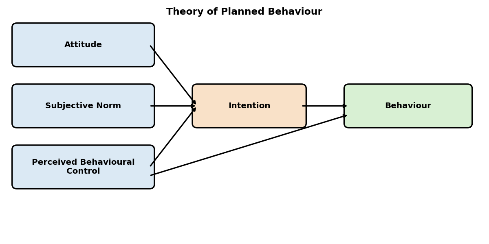
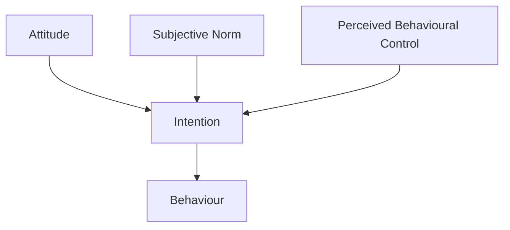

# Mermaid extraction demo

Real run on a synthetic Theory of Planned Behaviour diagram, with
Gemma 4 E2B Q3_K_S on a 1.9 GB / 2 vCPU sandbox.

## Input



Five boxes (Attitude, Subjective Norm, Perceived Behavioural Control,
Intention, Behaviour) connected by classic TPB arrows.

## Extraction

Run via:

```python
from pipeline_v2.vision.factory import make_model
from pipeline_v2.vision.mermaid_extract import MermaidExtractor

model = make_model("gemma4-e2b",
                    per_image_timeout=1000, ctx_size=1536)
extractor = MermaidExtractor(model, max_new_tokens=600)
result = extractor.extract(
    Path("output/_gemma_demo/tpb_diagram.png"),
    caption="Theory of Planned Behaviour")
print(result.mermaid)
```

## Output (verbatim)



- **5 nodes** extracted, each with the correct full label
- **4 arrows** extracted, each pointing the right way
- `confidence = 0.7`, `reason = "ok"` (passes syntactic validation)
- Wall-clock: 16.6 min (with the full think-then-answer cycle)

The model missed the optional direct `PBC → Behaviour` arrow (which
some TPB versions include) — that's the one inaccuracy. Otherwise
the diagram is structurally correct and Mermaid-renders identically
to the original in any GitHub README.

## When to use this in the pipeline

`runner.process_figure()` automatically calls `MermaidExtractor` for
figures whose classifier returns `FLOW_DIAGRAM` or `SCHEMATIC`. The
result is stored in `result.mermaid` (the ready-to-inject `\`\`\`mermaid
... \`\`\`` block) and `result.extracted_data["mermaid_nodes"]` /
`["mermaid_edges"]` for downstream tooling.

If the figure isn't a diagram (returns `UNREADABLE` or no valid
mermaid block) the pipeline cleanly falls back to the regular VLM
alt-text path.

## Cost trade-off

| Figure type            | Cost / figure | Output                          |
|------------------------|---------------|---------------------------------|
| Diagram → Mermaid      | 10-17 min     | Inline rendered diagram         |
| Chart → classical+VLM  | 5-90 s        | Real markdown table             |
| Non-chart → VLM alt    | 2-6 min       | Single accurate sentence        |

For a typical corpus, ~5-10% of figures are diagrams (most are
charts, maps, or photos). At ~15 min per diagram, the diagram pass
adds ~1-2 hours to a 471-figure corpus run.
